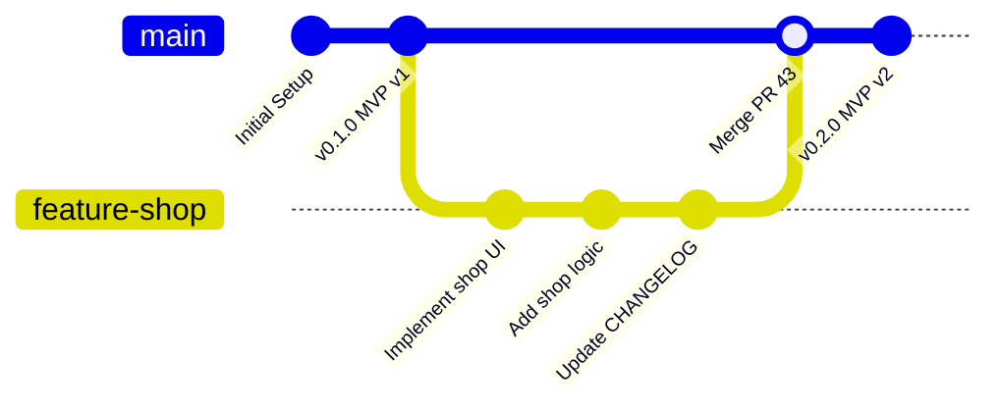

# Development Process

This document describes the actual development process, workflow, and tooling used by Team 33 GameDev to build and maintain **Click to Live**. It serves as the canonical reference for how the team manages the backlog, writes code, reviews changes, and deploys the game.

## 1. Product and Sprint Backlog Management

The team uses **GitHub Projects** to manage both the Product Backlog and the Sprint Backlog. 

### Board Configuration and Columns
We utilize a Kanban board view in GitHub Projects with the following columns, which map directly to the canonical Work Status values:

1. **To Do**: The Product Backlog. Items here are refined, estimated, and prioritized but not yet selected for the current Sprint.
   * *Entry Criteria:* The PBI has a clear description, MoSCoW priority, and Story Points.
2. **Sprint Backlog (Ready)**: Items selected for the current Sprint. 
   * *Entry Criteria:* The PBI is assigned to the current Sprint milestone, has an assignee, a designated reviewer, and complete Acceptance Criteria.
3. **In Progress**: Work has actively started on the PBI. A branch has been created, and development is underway.
4. **Review**: The implementation is complete, and a Pull Request (PR) is open and waiting for or undergoing peer review.
5. **Done**: The PR has been merged into `main`, all CI checks pass, Acceptance Criteria are verified, and the issue is closed.

### Views
* **Product Backlog View**: A table view grouped by `MVP version` and ordered by MoSCoW priority.
* **Sprint Backlog View**: A board view filtered to show only items assigned to the current Sprint milestone.

## 2. Git and Review Workflow

The team follows a feature-branch workflow based on GitHub Flow, utilizing a protected `main` branch.

### Issue Creation and Usage
* All work is tracked via GitHub Issues using standardized templates: **User Story**, **Other PBI**, **Course Task**, and **Bug Report**.
* Blank issue creation is disabled to enforce template usage.
* Issues serve as the single source of truth for requirements, acceptance criteria, and traceability. 

### Branching Strategy and Naming
* Branches are created directly from the issue page in GitHub (or manually from the latest `main` commit).
* Branch names must follow the format: `<issue-number>-short-description` (e.g., `42-add-shop-room` or `45-fix-autoclicker-bug`).
* Branches are kept short-lived to minimize merge conflicts.

### Pull Request (PR) Submission and Review
* When a feature or fix is ready, the developer opens a PR targeting the `main` branch.
* The PR description must use the extended PR template, which requires:
  * A link to the related issue (e.g., `Closes #42`).
  * A summary of changes and testing performed.
  * A checklist confirming that Acceptance Criteria were verified locally.
  * A checklist confirming `CHANGELOG.md` was updated (if user-visible).
* **Review Process:** The PR must be reviewed and approved by at least one team member *other than the author*. Reviewers check for code quality, adherence to architecture decisions, and test coverage. Comments and requested changes are handled directly within the GitHub PR interface.

### Merging and Issue Resolution
* **Merge Strategy:** We use standard **Merge Commits**. Squash and rebase merging are disabled in the repository settings to preserve a clear, traceable history of feature branches.
* **Resolution:** Once a PR is merged, the associated issue is automatically closed by GitHub (via the `Closes #...` keyword). The issue is then moved to the **Done** column on the Sprint Board.

### Git Workflow Diagram

The following Mermaid diagram illustrates our standard branching and merging workflow:

**Explanation of the Diagram:**
1. Development starts on the `main` branch, which represents the stable, releasable state of the game.
2. When a developer picks up an issue (e.g., `#42 Add Shop Room`), they create a dedicated feature branch (`42-add-shop-room`).
3. The developer makes incremental commits on this feature branch.
4. Once the work is complete and reviewed, the feature branch is merged back into `main` using a merge commit.
5. The `main` branch is then tagged for a SemVer release (e.g., `v0.2.0`), and the feature branch is deleted.

## 3. Configuration and Secrets Management

### Secrets Storage and Ignored Files
* **Secrets:** Any sensitive data (e.g., backend API keys, analytics tokens) is stored in environment variables. We never commit real secrets to the repository.
* **Sanitized Examples:** A sanitized `.env.example` file is committed to the repository root to document required environment variables without exposing actual values.
* **Ignored Files:** The `.gitignore` file is strictly enforced. It excludes:
  * `.godot/` (Godot's generated cache and import directory).
  * `.env` (Actual environment variables).
  * `build/`, `*.exe`, `*.apk`, `*.zip` (Exported game binaries and archives).
  * `*.import` (Godot's auto-generated import metadata, though we commit the source assets).

### Runtime Configuration
* **Game Data:** Read-only game assets and configurations are stored in the `res://` directory.
* **User Data:** Save files, user preferences, and dynamic configurations are written to the `user://` directory at runtime, ensuring the game does not require write permissions to the installation folder.

### CI and Deployment Configuration
* CI pipelines are defined in `.github/workflows/` using YAML.
* Deployment configuration (Godot Export Presets) is stored in `export_presets.cfg`. Secrets required for the export process (like Android keystore passwords) are injected via GitHub Actions secrets during the CI/CD pipeline.

## 4. Reproducible Development Environment

To ensure all team members can run and build the game consistently, we maintain the following environment expectations:

* **Game Engine:** The project strictly requires **Godot Engine 4.2.2** (or the specific stable version defined in `project.godot`). Version mismatches can cause scene file incompatibilities.
* **Setup Steps:**
  1. Clone the repository: `git clone <repo-url>`
  2. Download and install the exact Godot Engine version specified in the root `README.md`.
  3. Open the Godot Project Manager and import `project.godot`.
  4. Godot will automatically re-import assets and generate the `.godot/` cache directory.
  5. (Optional) Copy `.env.example` to `.env` and fill in any required local API keys for backend services.
* **Dependencies:** As a Godot project, we do not use traditional package managers like npm. However, we utilize Godot's built-in AssetLib for specific plugins (e.g., GdUnit4 for testing), which are committed directly to the `addons/` folder to ensure offline reproducibility.

## 5. Continuous Integration (CI) and Deployment

### CI Process
We use **GitHub Actions** to enforce quality gates on every Pull Request and every push to the `main` branch. The CI pipeline includes:
1. **Lychee Link Checker:** Validates all Markdown links in the repository.
2. **GDScript Linting:** Uses `gdtoolkit` to enforce code style and catch syntax errors.
3. **Automated Testing:** Runs unit and integration tests using the **GdUnit4** framework in Godot's headless mode.
4. **Build Verification:** Attempts a headless export of the project to ensure no missing dependencies or broken resource paths prevent the game from building.
5. **Additional QA Check:** Runs a dependency and asset size check to prevent large binaries from accidentally entering the Git history.

*All CI checks must pass before a PR can be merged.*

### Deployment Automation
The team uses continuous delivery for game builds. 
* When a new SemVer tag (e.g., `v0.2.0`) is pushed to the `main` branch, a dedicated GitHub Actions workflow is triggered.
* This workflow uses the Godot CLI to export the project for Windows, Linux, and macOS.
* The resulting build artifacts are automatically packaged and uploaded to the corresponding **GitHub Release**, making the latest playable increment instantly accessible to the customer and graders.
